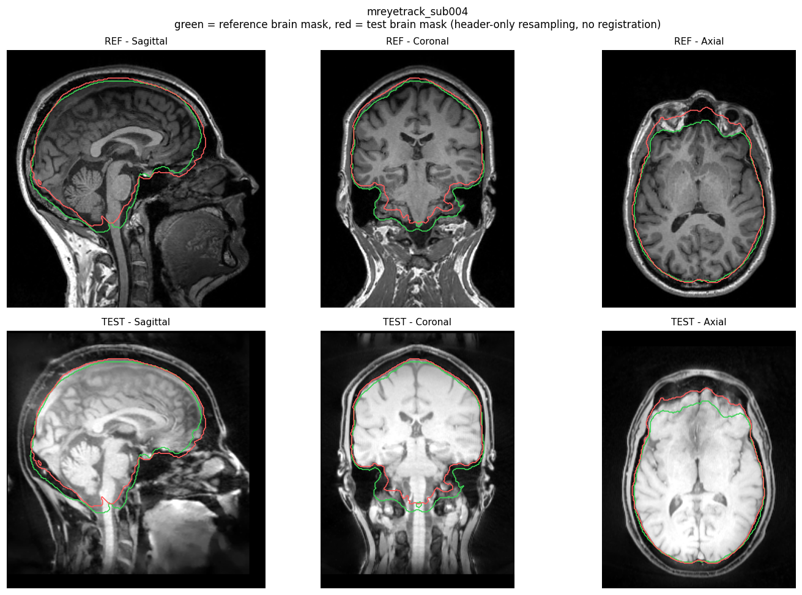
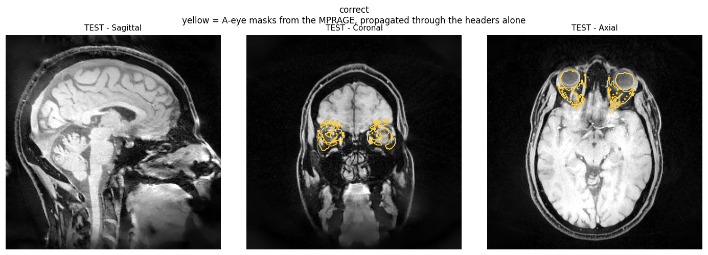
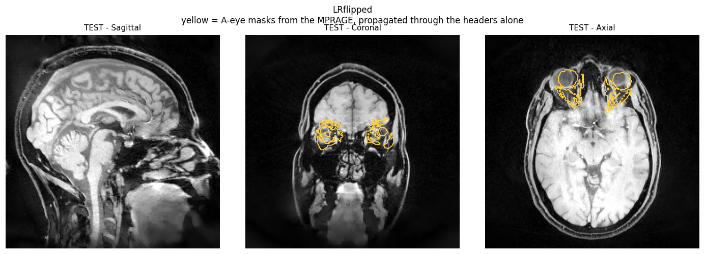
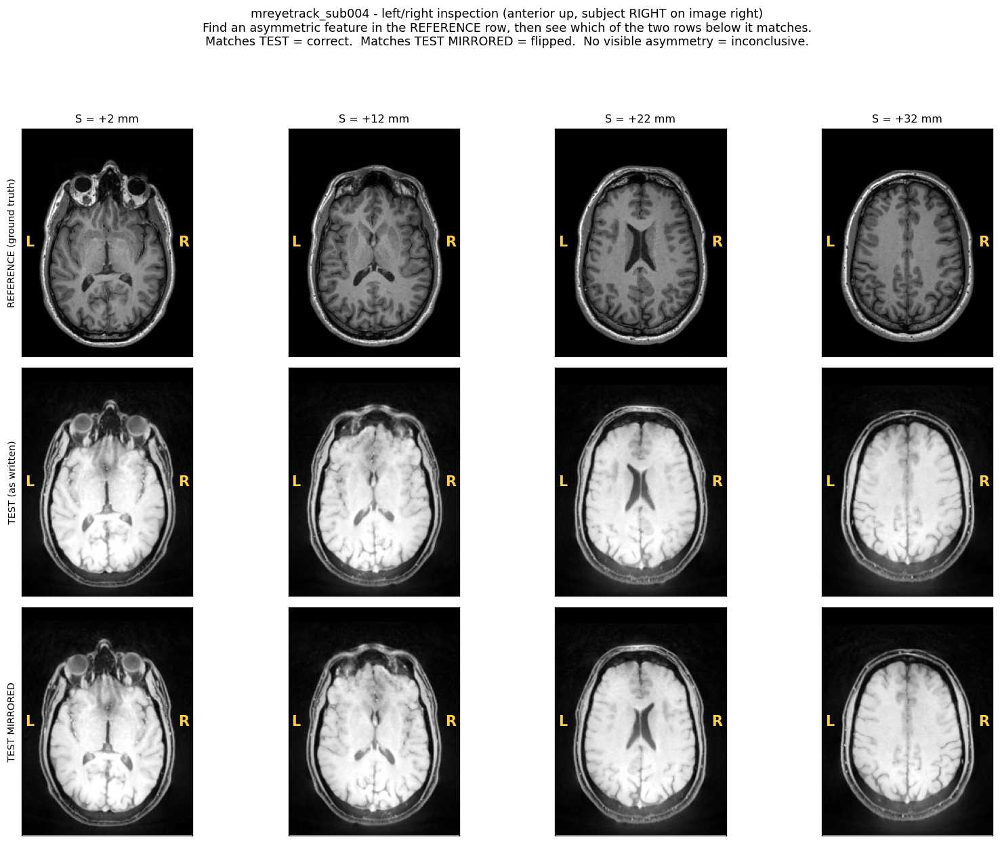
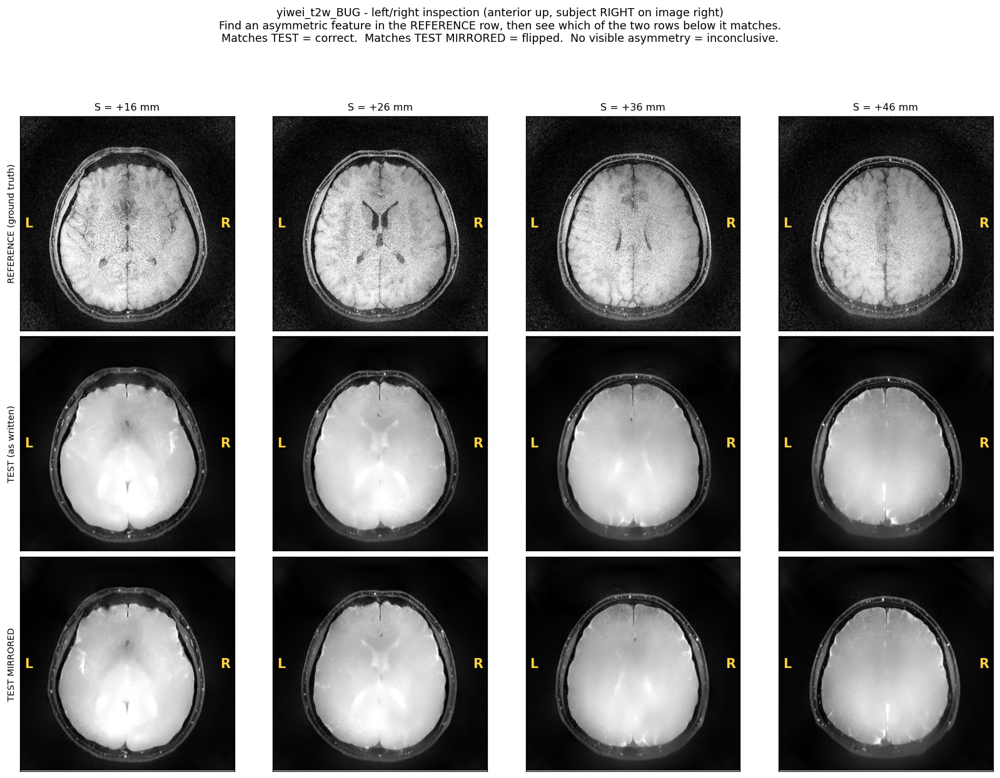

# Tissue-based orientation validation

Checks that a NIfTI produced by `mat2nii_twix` is geometrically correct by
asking whether segmented tissue lands in the same place as in the reference
MPRAGE. Complements [`check_nifti_orientation.m`](../check_nifti_orientation.m),
which compares affine headers and central slices visually; this one measures
the anatomy.

Segmentation is done with **SynthStrip**, which is contrast agnostic by
construction (trained on synthetic images sampled over arbitrary contrasts), so
it works on fat-suppressed LIBRE T1w and T2w without retraining. Nothing here
is trained or fine-tuned.

## What is segmented

**`orientation_check.py` — SynthStrip: the brain, and only the brain.** One
binary mask of the whole intracranial brain (cerebrum, cerebellum, brainstem,
plus some CSF and dura). No tissue classes, no per-structure labels — a single
blob, ~1.5–1.8 L. That is deliberate: the mask only has to be a spatially
well-defined object produced identically on both contrasts, and a whole-brain
mask is the most robust such object across MPRAGE and LIBRE.

**`eye_roi_check.py` — A-eye: 9 orbital structures per eye.** Label map from
`a-eye_web/package/biomarkers/biomarkers.py`:

| label | structure | label | structure |
|---|---|---|---|
| 1 | lens | 6 | lateral rectus |
| 2 | globe (ex-lens) | 7 | medial rectus |
| 3 | optic nerve | 8 | inferior rectus |
| 4 | intraconal fat | 9 | superior rectus |
| 5 | extraconal fat | | |

These names are printed in the reports, so the per-structure rows are readable
without cross-referencing the label numbers.

**Why the results below say "27 measurements".** Each label is scored per orbit,
and then split into connected components, because a label arriving in several
disconnected pieces is several independent places to check rather than one. The
9 labels across 2 orbits give 18 label-side pairs; for sub-004, splitting adds
9 more rows:

| | rows |
|---|---|
| 16 label-side pairs arriving as a single component | 16 |
| `ext_fat-L` and `ext_fat-R`, 5 components each | 10 |
| `inf_mus-L`, 2 components | 2 |
| **total** | **27** |

So it is 27 *measurements*, not 27 anatomical structures — there are 18 of
those. Worth remembering when reading a median across them: the small
extraconal-fat fragments are noisier than the globe or the muscles, and they
are counted equally.

## Why it is not circular

The obvious approach — register the test image to the MPRAGE, then compare
segmentations — measures nothing. A good registration absorbs a 90° rotation or
an L–R flip and returns a high Dice on a completely wrong header.

So registration is the *measurement*, not the preprocessing, and three
quantities are kept apart:

| Quantity | Role |
|---|---|
| **header-only Dice** | **The test.** Test mask resampled into the reference grid through the two affines alone. Any orientation error destroys it. |
| **registered Dice** | **The ceiling.** Same overlap after rigid registration — the best achievable given segmentation noise and genuine head motion. Makes the header-only score interpretable. |
| **recovered rigid transform** | **The diagnostic.** What registration had to invent starting from the header alignment. Near-identity = correct header; near a signed axis permutation = bug. |

Registration is deliberately **not** initialised by centre-of-mass or moments —
it starts from the identity in physical space, i.e. from what the headers say,
so the recovered transform measures header error directly. Mattes MI is used
because the two images are different contrasts by construction.

`--controls` scores all 48 signed axis permutations of the test volume with the
header-only metric. This is what turns a bare Dice number into a test with
known sensitivity: it shows how far the as-written orientation sits above the
best wrong one. A wrong `reorientFcn` is *exactly* a signed permutation of the
data array under an unchanged affine (`mat2nii_twix` copies direction cosines
from the reference regardless of data order), so these are realistic negatives.

## Usage

```bash
PY=/home/debi/miniconda3/envs/mreyetrack/bin/python

# brain-level check
$PY orientation_check.py \
  --ref  data/study/sub-004/dicom/csTFL_mp-rage_1mm-iso_CP_acc4.6_5_MR/sub-004.nii.gz \
  --test data/study/sub-004/recon/woBin/x_steva_nIter_20_delta_1.000_twix.nii.gz \
  --out  /home/debi/jaime/orientation_check/mreyetrack_sub004 \
  --label mreyetrack_sub004 --controls --affine-check

# localised check at the orbit, using A-eye masks from the MPRAGE
$PY eye_roi_check.py \
  --ref  <same MPRAGE> --test <same recon> \
  --masks /home/debi/jaime/orientation_check/aeye_sub004/out5/sub004.nii.gz \
  --out  /home/debi/jaime/orientation_check/eye_sub004 --label mreyetrack_sub004
```

### Outputs

CSV / JSON / PNG results for the runs described below are committed under
[`results/`](results/). The NIfTI masks are not — they stay in the working
directory (`/home/debi/jaime/orientation_check/`) because of their size:

| file | what it is |
|---|---|
| `aeye_both_sub004/sub-004_aeye_both.nii.gz` | A-eye, both orbits, 9 labels, in MPRAGE space |
| `eye_both_sub004/eye_masks_on_test_correct.nii.gz` | those masks propagated into the test volume, headers only |
| `eye_both_sub004/eye_masks_on_test_LRflipped.nii.gz` | same, into the L–R-flipped test volume |
| `test_LRflipped.nii.gz` | the deliberately flipped test volume used for the control |
| `mreyetrack_sub004/ref_mask.nii.gz`, `test_mask.nii.gz` | SynthStrip brain masks |

Written into `--out`, one set per `--label`:

| file | contents |
|---|---|
| `report_<label>.csv` | one row per dataset — both Dice values, gap, centroid distance, HD95, rotation, translation, displacements, min affine scale, control rank, verdict. Rows from several runs concatenate into a study-level table. |
| `report_<label>.json` | everything above plus the full per-run detail |
| `controls_<label>.csv` | all 48 signed permutations ranked by Dice (with `--controls`) |
| `qc_<label>.png` | reference and test volumes, both mask contours overlaid, header-only |
| `report_eye_<label>.csv` / `.json` | per-structure displacement, RAS components, separability before/after search |
| `qc_eye_<label>.png` | propagated A-eye masks over the test volume |
| `ref_mask.nii.gz`, `test_mask.nii.gz` | SynthStrip brain masks, for your own inspection |
| `eye_masks_on_test_<label>.nii.gz` | propagated A-eye masks in test space, openable in ITK-SNAP |

### Producing the A-eye masks

A-eye is trained on standard T1w and is out of distribution on LIBRE, so it is
run on the **MPRAGE only** and its masks are pushed into the test volume through
the headers.

Task313_Eye is a single-orbit model: run on a whole head it segments one eye and
ignores the other. `run_aeye.py` gets both eyes the way `a-eye_web` does —
crop the left and right anterior quadrants, segment each, uncrop and merge
(`a-eye_web/package/quadrant_segmentation/quadrant.py`):

```bash
python run_aeye.py --input <mprage>.nii.gz --out WORKDIR   # ~10 min CPU, both orbits
python run_aeye.py --input <mprage>.nii.gz --out WORKDIR --sudo-gpu --fold 0   # faster
```

**One difference from `quadrant.py`, and it matters:** the input is first
reoriented to canonical RAS. `quadrant.py` slices `data[:mid_x, mid_y:, :]`,
which assumes array axis 0 is left–right and axis 1 is anterior–posterior. That
holds for MR-EyeTrack MPRAGEs (axcodes RAS) but **not** for Yiwei's, whose
axcodes are `('P','I','L')` — there the same slice takes an inferior/posterior
quadrant and finds no eye at all. Reorienting first makes the assumption true
for any input. Worth porting back into `a-eye_web` if it ever sees data from
another site.

`run_aeye.py` also shifts the crop affine to the corner the crop starts at,
where `quadrant.py` keeps the uncropped origin. **Do not port that part back
into `a-eye_web`** — it is safe here and breaks things there.

The difference is what each pipeline does with the crop's affine afterwards.
`run_aeye.py` builds the merged mask with the *original* affine, so the crop's
origin is never reused. `a-eye_web`'s `uncrop_quadrant` returns
`nib.Nifti1Image(full_data, cropped_img.affine, ...)` — it puts the crop's
affine on the full-size array. That only gives the right answer if the crop
still carries the uncropped origin, so keeping it there is load-bearing, not an
oversight. Shifting it displaces the result by the crop offset: measured
round-trip error of 128 mm for the left quadrant and 160 mm for the right, which
puts the mask well off the head.

The canonical-RAS reorientation above is a separate change and is safe in both.

GPU: plain `--gpus all` fails on this host — the unprivileged Docker daemon has
no NVIDIA container toolkit configured — but it works under `sudo`, which is
what `--sudo-gpu` does. Since sudo prompts for a password it only works
interactively. CPU is ~1 min per fold per orbit, so the 5-fold ensemble over
both orbits is ~10 min.

## Results

Three datasets, all `mat2nii_twix` outputs against their session MPRAGE:

| dataset | header Dice | ceiling | gap | centroid | rotation | brain disp. | verdict |
|---|---|---|---|---|---|---|---|
| MR-EyeTrack sub-004 T1w LIBRE | 0.9464 | 0.9849 | 0.039 | 4.16 mm | 7.57° | 7.04 mm | PASS |
| Yiwei 0005 T1w LIBRE | 0.9319 | 0.9842 | 0.052 | 6.37 mm | 4.99° | 6.62 mm | PASS |
| Yiwei 0005 T2w LIBRE | 0.9393 | 0.9733 | 0.034 | 5.39 mm | 5.67° | 6.17 mm | PASS |

All three sit within 0.05 Dice of their ceiling, with residual rotations of
5–8° and brain displacements of ~6 mm — small, arbitrary rigid transforms, i.e.
inter-scan head motion, not signed axis permutations. The `reorientFcn`
conventions recorded in `mat2nii_twix.m` are confirmed correct for all three.



*Green = reference brain mask, red = test brain mask, resampled through the two
affines with no registration. Top row the MPRAGE, bottom row the LIBRE recon.
The contours nearly coincide; the small offset — red sitting higher anteriorly
and lower posteriorly in the sagittal view — is the 7.6° pitch rotation between
the two acquisitions, i.e. the subject nodded. Note how different the two
contrasts look, and that SynthStrip segmented both anyway.*

The eye check on sub-004 gives a median displacement of 6.00 mm across 27
measurements, against a brain-level residual of 6.98 mm mean / 11.71 mm p95, with
the displacement dominated by the −S direction in agreement with the
brain-level translation. Orbit and brain agree, which is what a correct header
plus ordinary head motion looks like.



*Yellow = the nine A-eye labels per orbit, segmented on the MPRAGE and pushed
into the LIBRE volume through the headers alone. They land on both orbits. A-eye
never ran on the LIBRE — it cannot, see below — so this checks the geometry at
the orbit without asking the model to work out of distribution.*

## Sensitivity, and the one blind spot

From `--controls`, per dataset:

| dataset | as-written | L–R flip | next-best wrong | rank |
|---|---|---|---|---|
| MR-EyeTrack sub-004 | 0.9464 | 0.9441 | 0.8628 | 1 of 48 |
| Yiwei T1w | 0.9319 | 0.9296 | 0.8714 | 1 of 48 |
| Yiwei T2w *(old fcn)* | 0.9393 | **0.9406** | 0.8793 | **2 of 48** |
| Yiwei T2w **(corrected)** | **0.9396** | 0.9379 | 0.8786 | **1 of 48** |

That last pair is worth dwelling on. The T2w ranking 2 of 48 — the flip beating
the truth by 0.0013 — was the *first* sign of the reorientFcn bug, and it was
dismissed as noise on the grounds that mask overlap cannot see flips. It cannot
see them *reliably*, but here it was reading a real signal. After the correction
the ranking moves to 1 of 48. A margin this small is never sufficient evidence on
its own, but it is worth following up rather than explaining away.

The metric rejects 46 of the 47 wrong orientations decisively — the median
across all 48 is ~0.48, and the best non-flip error is ~0.87, well clear of the
~0.93–0.95 achieved by the truth.

**Mask overlap cannot resolve a left–right flip.** The flip lands within ±0.25%
of the true orientation in all three datasets, and on the T2w it *scores higher
than the truth*. The eye check does not help either: the flip maps the left
globe onto the right globe.

The reason is specific, and it points straight at the fix: a brain mask is the
*outer envelope* of the brain, which really is close to mirror-symmetric. So is
the pair of orbits. Any measure built on the shape of a near-symmetric object is
blind here.

The images are not symmetric. Ventricles and sulcal patterns are strongly
asymmetric and highly individual, and an intensity metric sees all of it —
which is why `lr_flip_test.py` below settles the question decisively.

### The eye check does not rescue it — measured, not argued

The obvious hope is that a single-orbit mask disambiguates: if it lands on the
*other* orbit, you would see it. It does not work, and the reason is worth being
precise about. Which orbit is "left" in the test image is decided by the affine
under test, so a viewer renders the flipped volume mirrored and the mask appears
in exactly the same place. Propagating a left-orbit mask into an L–R-flipped
volume lands it on the physical right orbit *mirrored*, which by bilateral
symmetry is nearly a left orbit. The only residual is the subject's true orbital
asymmetry — a couple of mm, swamped by head motion.

Measured on sub-004, both orbits, 27 measurements, correct volume vs a
deliberately L–R-flipped copy:

| | correct | flipped |
|---|---|---|
| displacement median | 6.00 mm | 7.81 mm |
| displacement mean ± sd | 6.55 ± 2.37 mm | 7.49 ± 2.24 mm |
| separability median | 0.246 | 0.199 |

Paired difference +0.93 ± 2.60 mm; the flipped volume is worse for 17 of 27
measurements where a coin flip gives 14; Cohen's d = 0.41, where a usable test
needs roughly d > 2.



*The same masks on a volume that has been deliberately L–R flipped. They still
land cleanly on both orbits — compare against the correct version above and the
two are, for practical purposes, indistinguishable. The yellow contours are in
fact **bit-identical** between the two figures: mask propagation depends only on
the affine, which mirroring the data array does not change. Only the background
differs, which is enough to make one look like a better fit than the other
depending on which orbit you attend to.*

So **visual inspection of which orbit was segmented cannot settle L–R**, and
neither can the displacement numbers. The bias is in the right direction but far
too small to act on for a single subject.

**Removing the head motion does not rescue it either.** The obvious objection is
that the ~6 mm of inter-scan motion swamps the smaller mismatch a mirror
produces, so `--rigid` was added to warp the test into reference space first. A
rigid transform is determinant +1 and cannot create or undo a mirror, so this
removes the nuisance without touching the question. Re-measured on sub-004 with
each volume given its own optimal rigid alignment:

| | header-only | with `--rigid` |
|---|---|---|
| displacement median, correct | 6.00 mm | **2.24 mm** |
| displacement median, flipped | 7.81 mm | 3.74 mm |
| flipped worse for | 17 of 27 | 15 of 27 (chance = 14) |
| Cohen's d | 0.41 | **0.20** |

Discrimination got *worse*, not better: both volumes align well once motion is
gone, because the orbits are near-symmetric about the midline and the mirrored
volume's own registration places them almost where the true ones sit. Three of
the four globes and lenses favour the flipped volume.

`--rigid` is still worth using — halving the median displacement to 2.24 mm
confirms the residual really was head motion, which is what makes this a clean
*geometry* check. It is simply not an L–R check, with or without it. Use
`lr_flip_test.py` for that.

### What can still settle it: your own eyes, on your own asymmetry

The automated measures fail because they average over a near-symmetric object.
A human does not have to: an individual brain is *not* perfectly symmetric, and
a distinctive ventricle horn or sulcal pattern is exactly the "physically
asymmetric fact" the metrics lack.

`lr_inspect.py` renders the reference, the test volume, and a mirrored copy of
the test volume at matched anatomical planes:

```bash
python lr_inspect.py --ref <mprage>.nii.gz --test <recon>.nii.gz \
  --mask  <workdir>/ref_mask.nii.gz \
  --rigid <workdir>/rigid0GenericAffine.mat \
  --out results/lr_inspect --label <name>
```

Find one clearly asymmetric feature in the reference row, then see which row
below it matches: **TEST → left–right is correct; TEST MIRRORED → flipped; no
visible asymmetry → inconclusive**, and it must be recorded as inconclusive
rather than passed.

`--mask` matters: without it the slice levels are estimated from intensity, and
on a whole-head FoV the face and neck drag the centroid ~40 mm inferior, putting
the panels through the skull base instead of the ventricles. `--rigid` matters
too — the scans differ by a few degrees of head rotation, so slices at equal
world coordinates are not the same anatomical plane, which blurs the fine
asymmetries the panel exists for. A rigid transform has determinant +1 and so
cannot create or undo a mirror; using it matches planes without touching the
question being asked.

Two assumptions: the reference's own left–right is taken as ground truth (it
comes from DICOM through dcm2niix, whose handling of the patient coordinate
system is well tested), and absence of visible asymmetry is not evidence of
correctness.



*Reference, test, and a mirrored copy of the test at matched anatomical planes.
The occipital horn at S = +12 mm and the ventricle body at S = +22 mm are
visibly asymmetric, and they favour TEST — worth confirming at full resolution
in a viewer before recording it. This is the asymmetry the mask-based metrics
average away and that `lr_flip_test.py` measures.*

**And the case where this does not work.** The same panel for Yiwei's T2w, whose
`reorientFcn` really was flipped, is far less useful:



*The T2w's internal contrast is washed out, so the ventricles that carry the
asymmetry are barely visible and neither row below is clearly the better match —
even though this volume genuinely was mirrored. Visual inspection would have
missed this bug. It is also why the T2w-against-MPRAGE comparison was
underpowered, and why the same-session T1w LIBRE was needed as the reference.*

### `lr_flip_test.py` — the test that resolves it

```bash
python lr_flip_test.py --ref <reference>.nii.gz --test <recon>.nii.gz \
  --mask <workdir>/ref_mask.nii.gz --out results/lr_<name> --label <name>
```

Rigidly registers the test volume *and a mirrored copy of it* to the reference,
then compares how well each ends up matching (MI and CC, inside the brain mask).
A rigid transform is determinant +1 and cannot create or undo a mirror, so
neither registration can rescue the wrong hypothesis — each gets its best
possible alignment and the better fit is the true orientation. Both
registrations are reported so you can confirm neither failed; a failed
registration mimics an anatomical mismatch and must be discarded.

| dataset | reference | MI margin | CC margin | verdict |
|---|---|---|---|---|
| MR-EyeTrack sub-004 T1w LIBRE | MPRAGE | +0.2479 | +0.4583 | **PASS** |
| Yiwei T1w LIBRE | MPRAGE | +0.1125 | +0.2256 | **PASS** |
| Yiwei T2w LIBRE *(old fcn)* | MPRAGE | −0.0060 | −0.0265 | inconclusive |
| Yiwei T2w LIBRE *(old fcn)* | **T1w LIBRE, same session** | −0.1643 | −0.0459 | **FAIL — flipped** |
| Yiwei T2w LIBRE **(corrected)** | T1w LIBRE, same session | **+0.1647** | **+0.0459** | **PASS** |
| Yiwei T2w LIBRE **(corrected)** | MPRAGE | +0.0137 | +0.0254 | inconclusive |
| *control:* MPRAGE | T1w LIBRE | +0.1048 | +0.1067 | **PASS** |

The correction was verified by regenerating the T2w through `mat2nii_twix` with
the fixed function: the output is exactly the L–R mirror of the original with an
identical affine, so handedness changed and nothing else. Both comparisons then
inverted sign, and the high-power one (against the same-session T1w) matches its
pre-fix magnitude to within 0.0004 — the registration noise floor.

The MPRAGE comparison stays flagged inconclusive after the fix because the gate
requires *both* margins above 0.02 and MI reached 0.0137. That is the threshold
being conservative on an underpowered pairing, not a disagreement: both signs
now favour the corrected orientation.

Positive margin = the as-written orientation fits better. The noise floor is
~0.0004, so the passes are overwhelming.

**Test power depends on how well the reference and test correspond.** The T2w
against the MPRAGE was inconclusive — its absolute CC is only 0.136 against the
T1w's 0.341, because T2w-versus-T1w-MPRAGE is a hard cross-contrast match and
there is little signal to separate the hypotheses. Against the T1w LIBRE of the
same session (same contrast family, ~1° of head motion) the same test is
decisive. When a result is inconclusive, look for a better-matched reference
before concluding anything.

The last row is a control: with a LIBRE volume as the *reference* and a
known-correct MPRAGE as the test, the result must be PASS. It is, so the
LIBRE-as-reference configuration introduces no sign error of its own.

### Finding: the Yiwei T2w reorientFcn appears to be L–R flipped

Three independent lines agree. The 48-permutation mask-Dice control ranked the
flip 1st and the as-written orientation 2nd (0.9406 vs 0.9393) — dismissed as
noise at the time. Image similarity against the MPRAGE gave negative margins,
weakly. Image similarity against the same-session T1w LIBRE gave a decisive
FAIL. Every control passes.

The raw axes are (−R, −S, −A) rather than (+R, −S, −A), and the fix is to
**drop the dim-3 flip**:

```matlab
% was: @(v) flip(flip(permute(v,[1 3 2 (4:ndims(v))]),2),3)
reorientFcn_t2w = @(v) flip(permute(v,[1 3 2 (4:ndims(v))]),2);
```

Note the left–right axis here is **dim 3, not dim 1**. `mat2nii_twix` writes the
reorientFcn output verbatim and takes the direction cosines from the reference,
so the output must match the *reference's* storage order — which is only RAS
when the reference itself is RAS. MR-EyeTrack MPRAGEs are `('R','A','S')`, but
Yiwei's are `('P','I','L')`, so its written array runs A-P, S-I, L-R. Adding an
outer `flip(...,3)` cancels the flip already there, which is why the correction
is a removal: the original had one flip too many.

**Why the Mango check missed it:** visual inspection cannot detect an L–R flip.
A mirrored brain looks entirely plausible, and the derivation procedure reads
axis *identity* and *rotation* from the displayed planes — neither of which
changes under a mirror. This is the same blindness that affects mask overlap,
and it is why the convention was recorded as confirmed.

### Other routes to left–right

A-eye is **mirror-equivariant** — nnU-Net trains with `mirror_axes (0, 1, 2)`,
so the network cannot use left–right position as a cue. Verified directly: on a
mirrored MPRAGE it tracked the same physical orbit to its new array slot with
0.0 voxels of error, and its reported side went LEFT → RIGHT. Its orbit
preference is stable to 0.07 mm across runs. That makes whole-head A-eye a valid
L–R check *on T1w*.

It cannot reach the reconstructions: A-eye returns **zero voxels** on
fat-suppressed LIBRE. It keys on orbital fat (labels 4 and 5), which is bright in
MPRAGE and suppressed to dark in LIBRE — the contrast is inverted exactly where
the model looks. Not a FoV problem; the same whole-head geometry works on MPRAGE.
`aeye_chirality_test.py` runs this check for any dataset.

Beyond these, a physically asymmetric fact would settle it outright:

- a unilateral fiducial (vitamin E capsule) at acquisition — settles it
  permanently, costs 30 s of setup;
- opposed gaze-direction bins, where the globes deviate in opposite directions
  along L–R (available in MR-EyeTrack only, deliberately not implemented here
  since the tool is meant to generalise across projects).

Until one of those exists, treat L–R as **unverified** rather than confirmed.

## Notes on this host

- Docker only bind-mounts paths under `/home/debi`; a work dir in `/tmp` fails.
  The scripts warn about this.
- The Docker VM now has 64 GiB (raised from ~7.7 GiB). At the old limit a 480³
  volume sat close enough to the ceiling that two concurrent SynthStrip jobs
  could kill each other mid-frame — the retry in `synthstrip()` was written for
  that and is kept as cheap insurance, but it should no longer be triggered, and
  large cases can now be run in parallel.
- ANTs is at `/usr/local/ants-2.6.3-ubuntu-24.04-X64-gcc/ants-2.6.3/bin`
  (override with `$ANTSPATH`).
- **Reproducibility.** The header-only Dice is fully deterministic and repeats
  bit-for-bit (0.9464 / 0.9319 / 0.9393 across two independent runs) — it
  involves no optimiser. Everything derived from registration does not: MI uses
  `Regular,0.25` random sampling, so repeat runs move the rotation by ~0.1° and
  the registered Dice by ~0.0004. Treat the header-only Dice as the number to
  quote and the registration diagnostics as indicative.
- `--affine-check` scales are SVD singular values, so they are sorted by
  magnitude and do **not** correspond to named axes. The T2w case shows the
  smallest scale at 0.93–0.94 against 0.98–0.99 for the other two — but it moved
  from 0.9306 to 0.9444 between two identical runs, a 0.014 swing that is most of
  the apparent gap. A 12-DOF MI fit across contrasts is loosely constrained; this
  is a weak diagnostic, not a verdict, and should not be read as a real 7% FoV
  error without independent evidence.
