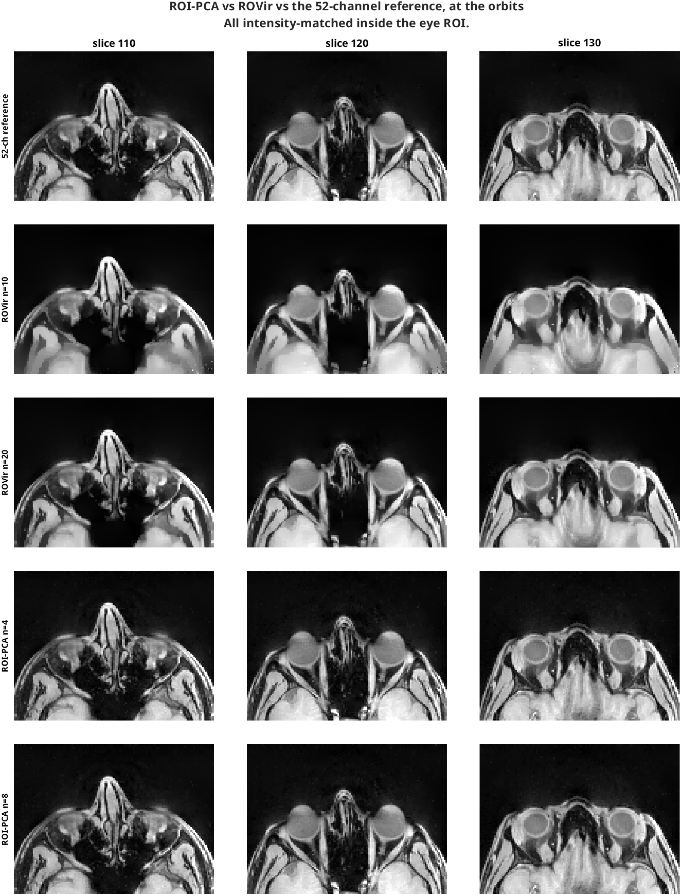
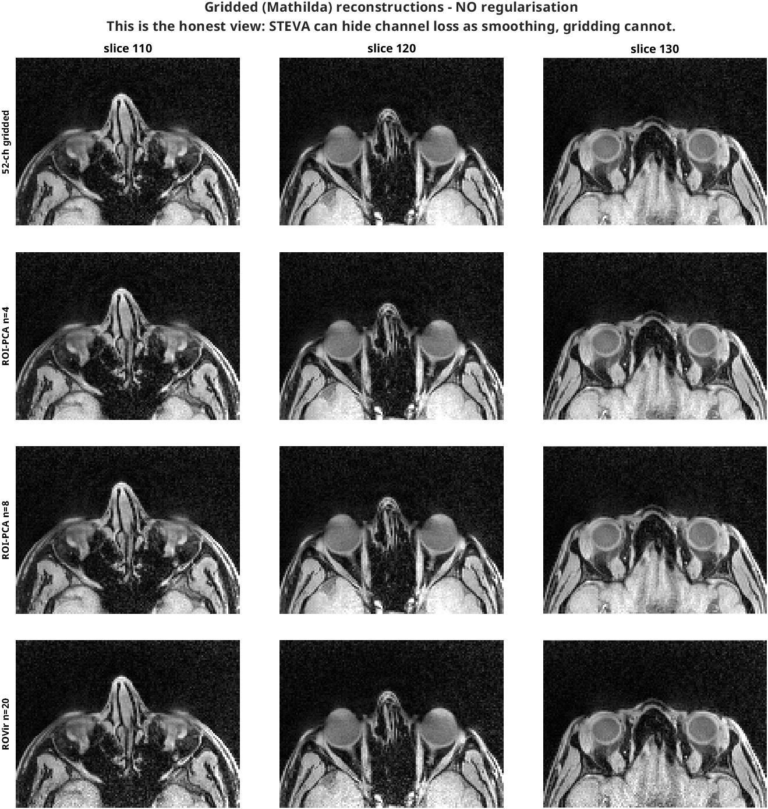
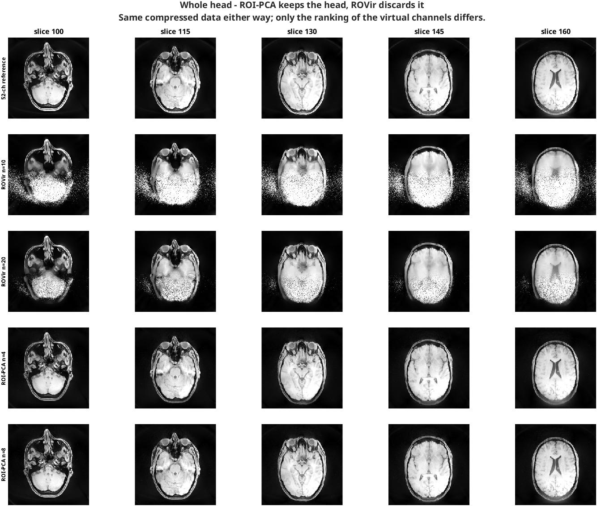
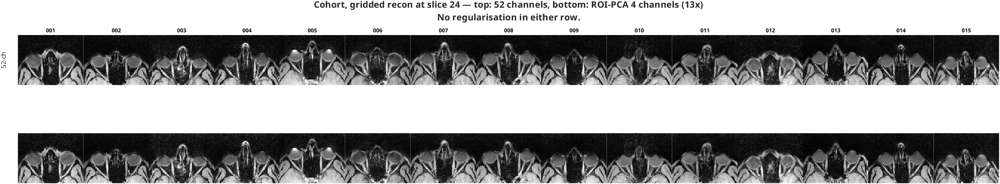
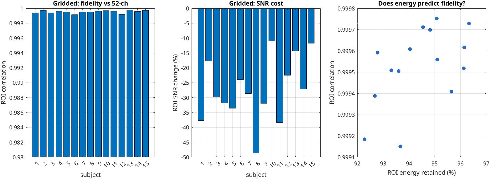
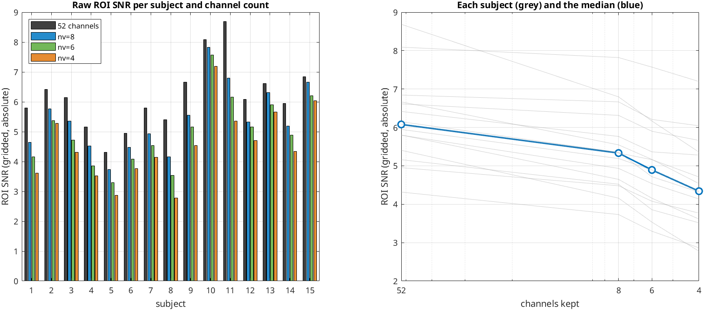

# ROI-PCA — eye-targeted k-space compression for MR-EyeTrack

Compress the raw k-space by recombining the 52 physical coils into a handful of
virtual channels chosen to capture the **eye region's** signal, so a model can
be trained on a fraction of the data without losing the orbits.

**Validated on all 15 subjects at three channel counts. Recommended operating
point: nv = 8 (6.5×)** — gridded ROI correlation ≥ 0.9998, NRMSE < 1.3%, and a
bounded SNR cost of 12.8% median / 23% worst. nv=4 reaches 13× and still
preserves structure (corr ≥ 0.9992) but costs 29% median / 49% worst SNR.

This is the sibling of [`recon/ROVir/`](../ROVir/README.md). Same solver,
different ranking. Read that README first for the method, the masks, and the
conventions; this one only covers what differs.

## How it differs from ROVir

Both solve the same generalised eigenvalue problem

```text
A v = lambda B v      A = sum_{v in ROI} x_v x_v^H     (orbits)
                      B = sum_{v in INT} x_v x_v^H     (rest of head)
```

ROVir ranks the eigenvectors by **signal-to-interference ratio**, so it
deliberately gives up eye signal to buy head suppression. That is the right
objective for defacing and the wrong one for compression.

ROI-PCA ranks by **ROI signal energy** instead. It is the same code with the
Tikhonov load taken to infinity: as `lambda` grows, `B` tends to a scaled
identity and the problem degenerates to `eig(A)` — equivalently the right
singular vectors of `X_roi`. There is no separate implementation, and `lambda`
is a continuous dial between the two:

| lambda | n=4: ROI % / head % |
|---|---|
| 1e-4 | 5.4 / 0.1 (ROVir) |
| 1 | 60.0 / 6.2 |
| 10 | 93.1 / 30.7 |
| **1e6** | **96.6 / 44.9** (ROI-PCA) |

The cost of ROI-PCA is that the head is **not** suppressed — it is still fully
reconstructable. If you need anonymisation, use ROVir. If you need small files,
use this.

## Running it

```matlab
run('recon/ROI-PCA/run_roi_pca.m')          % masks + transform (R1, R2)

variant = 'ROI-PCA';
run('recon/ROVir/R3_rovir_mitosius.m')      % reads raw, ~40 min, builds nv=8

srcNv = 8; deriveTo = [4 2];
run('recon/ROVir/R7_nv_table.m')            % derive smaller nv, no raw re-read
```

```bash
bash recon/ROVir/hpc/push_rovir.sh -s 15 -n 4 -v ROI-PCA --submit
bash recon/ROVir/hpc/push_rovir.sh -s 15 -n 4 -v ROI-PCA --pull
```

```matlab
variant='ROI-PCA'; nv=4; run('recon/ROVir/R5_export_compressed.m')  % k-space
variant='ROI-PCA';       run('recon/ROVir/R6_rovir_nifti.m')        % NIfTI
run('recon/ROI-PCA/R9_compare_variants.m')                          % table+figures
```

Only `run_roi_pca.m` (entry point) and `R9_compare_variants.m` (cross-variant
comparison) live here. Everything else is the shared ROVir code with
`variant = 'ROI-PCA'`, which routes all outputs to `recon/ROI-PCA/` and
`mitosius/ROI-PCA_<nv>/`. Forking R1–R8 would have duplicated ~1500 lines that
drift apart the first time either side is fixed — and this pipeline has already
had two silent convention bugs that would be miserable to fix in only one copy.

## Results, sub-015

### Reconstruction quality



Measured in the eye ROI against the 52-channel STEVA reconstruction, all
intensity-matched inside the ROI:

| recon | nv | compression | ROI NRMSE | ROI corr | bg sigma | ROI SNR |
|---|---:|---:|---:|---:|---:|---:|
| 52-ch reference | 52 | 1.0× | 0 | 1 | 6.57e-02 | 11.3 |
| **ROI-PCA** | **4** | **13.0×** | **0.031** | **0.9993** | 5.98e-02 | **12.4** |
| ROI-PCA | 8 | 6.5× | 0.029 | 0.9994 | 6.26e-02 | 11.8 |
| ROVir | 20 | 2.6× | 0.206 | 0.9703 | 1.26e-01 | 5.9 |
| ROVir | 10 | 5.2× | 0.296 | 0.9409 | 6.27e-01 | 1.2 |

**ROI-PCA at 4 channels is visually and numerically indistinguishable from the
full 52-channel reconstruction** — while ROVir at 10 channels, a *weaker*
compression, is clearly degraded.

> **Read the STEVA table with care — it is confounded.** These two
> reconstructions were normalised differently (the reference used the S3
> interactive `roipoly`, ours uses mean |x0| over the eye ROI), and their ROI
> intensities differ by 1.42x. `delta` is scale-dependent, so `delta = 1` did
> **not** apply equivalent regularisation to both. That is why ROI-PCA n=4
> appears to have *better* SNR than the 52-channel reference (12.4 vs 11.3) —
> an artefact of unequal smoothing, not a real gain. Discarding channels cannot
> increase SNR. Use the gridded comparison below to judge quality.

#### Gridded (Mathilda) — the unconfounded comparison



No regularisation anywhere, so nothing can hide channel loss as smoothing and
the `delta` confound does not apply. Against the 52-channel **gridded** recon:

| gridded recon | nv | ROI NRMSE | ROI corr | ROI SNR |
|---|---:|---:|---:|---:|
| 52-ch reference | 52 | 0 | 1 | 6.6 |
| **ROI-PCA** | **4** | **0.019** | **0.9997** | 5.8 |
| ROI-PCA | 8 | 0.007 | 1.0000 | 6.4 |
| ROVir | 20 | 0.211 | 0.9634 | 2.0 |

This is the result to quote. It is *stronger* on fidelity than the STEVA table
(correlation 0.9997, NRMSE 1.9%) and honest about the cost: **ROI SNR falls
6.6 -> 5.8, about 12%**, which is what discarding 48 of 52 channels should do.
At n=8 the loss is negligible (SNR 6.4, correlation 1.0000).



Whole head: ROI-PCA reconstructs everything, essentially matching the
reference. ROVir's discarded posterior returns as noise. Same compressed data
in both cases — only the choice of retained channels differs.

### Compression achieved

| | 52-ch original | ROI-PCA nv=8 | ROI-PCA nv=4 |
|---|---:|---:|---:|
| channels | 52 | 8 | **4** |
| channel compression | 1× | 6.5× | **13×** |
| k-space payload | 14.86 GiB | 2.29 GiB | **1.14 GiB** (92.3% saved) |
| exported `.mat` on disk | — | 3.21 GiB | **2.13 GiB** |
| mitosius on disk | 15 GB | 3.3 GB | **2.2 GB** |
| ROI energy retained | 100% | 99.4% | 96.6% |

Readout points per channel are unchanged (38 349 120) — this is a channel-axis
compression only.

**The payload shrinks by the full 13×, the file only by ~7×.** `t`
(460 MB) and `ve` (153 MB) are shared across all channels and do not compress
with `nv`, so at 4 channels they are already a third of the file; v7.3 storage
overhead accounts for the rest. If the model can regenerate the trajectory from
the sequence, or take it at reduced precision, that is where the next saving
is — not in `nv`.

Exported as
`data/study/sub-015/recon/ROI-PCA/kspace_ROI-PCA_<nv>_woBin.mat` by
`R5_export_compressed.m`:

```text
y    [38 349 120 x nv]  complex single   compressed k-space
t    [3 x 480 x 79894]  single           trajectory (kx, ky, kz)
ve   [1 x 38 349 120]   single           volume elements
meta                                     nv, nCh, retention, provenance
```

### How many channels

| n | ROI energy % | head % | compression |
|---:|---:|---:|---:|
| 2 | 89.1 | 26.4 | 26× |
| **4** | **96.6** | 44.9 | **13×** |
| 6 | 98.6 | 57.7 | 8.7× |
| 8 | 99.4 | 66.4 | 6.5× |
| 20 | 99.95 | 91.3 | 2.6× |

The eye signal lives in a nearly one-dimensional coil subspace (effective rank
of `A` is 1.1–1.6 for every ROI size tested), which is why so few channels
suffice. n=2 (26×) is untested and the obvious next step if 13× is not enough.

## Cohort results — all 15 subjects at nv=4

`R10_cohort_analysis.m` → `cohort_results_nv4.csv`, `figures/figE_*`,
`figures/figF_*`. Gridded (unregularised) comparison against each subject's own
52-channel gridded reconstruction:

| | min | median | max |
|---|---:|---:|---:|
| ROI correlation | 0.9992 | 0.9996 | 0.9998 |
| ROI NRMSE | 0.0165 | 0.0221 | 0.0309 |
| **ROI SNR change** | **−48.6%** | **−28.7%** | **−11.1%** |





Left: fidelity per subject, all above 0.999. Middle: the SNR cost, which is
where the spread lives. Right: ROI energy plotted against achieved fidelity —
the weak relationship is the point, see below.

**Structure survives everywhere; SNR is the real cost and it varies a lot.**
Every one of 15 subjects clears correlation 0.999, which is a much tighter
result than one subject could justify. But the SNR penalty is a median 29%,
not the ~12% measured on sub-015 — that subject is the 2nd-best in the cohort
and was not representative.

**ROI energy retention does not predict the SNR cost.** Correlation between
`roi_energy_pct` and the SNR change is only +0.31 (and +0.53 against fidelity).
So the energy table is a good tool for choosing *roughly* how many channels to
keep, and a poor one for predicting what it will cost on a given subject. If
SNR matters for the downstream task, measure it per subject rather than
inferring it from the energy curve — or use nv=6/8, which are already built.

### Choosing the channel count — all 15 subjects, all three counts

Gridded (unregularised) comparison against each subject's own 52-channel
gridded reconstruction:

| nv | compression | ROI corr (min) | NRMSE (median) | SNR change (median) | SNR change (worst) |
|---:|---:|---:|---:|---:|---:|
| 4 | 13.0× | 0.9992 | 0.0221 | −28.7% | −48.6% |
| 6 | 8.7× | 0.9994 | 0.0158 | −21.8% | −34.6% |
| **8** | **6.5×** | **0.9998** | **0.0083** | **−12.8%** | **−23.0%** |

Fidelity never discriminates — even 4 channels stays above 0.999 on every
subject. **SNR is the only axis that separates them**, and it improves
monotonically with channels.

**Take nv = 8.** Dropping 8 → 6 nearly doubles the worst-case SNR loss
(23% → 35%) to buy only 1.34× more compression. Per unit of compression that is
a worse trade than 6 → 4 (+6.9 pp for 1.49× vs +9.0 pp for 1.34×), which makes
nv=6 the weakest point on the curve: if a large SNR hit were acceptable you
would go straight to 4.

#### Raw SNR, not percentages



Percentages hide that subjects start from very different baselines — the
52-channel reference SNR spans 4.32 (sub-005) to 8.69 (sub-011), so "−25%"
means something different for each. Absolute values (`snr_by_channels.csv`,
generated by `R11_snr_figure.m`):

| subject | 52-ch | nv=8 | nv=6 | nv=4 |
|---|---:|---:|---:|---:|
| sub-001 | 5.80 | 4.65 | 4.16 | 3.61 |
| sub-002 | 6.42 | 5.77 | 5.36 | 5.28 |
| sub-003 | 6.15 | 5.35 | 4.72 | 4.32 |
| sub-004 | 5.16 | 4.52 | 3.86 | 3.52 |
| sub-005 | 4.32 | 3.73 | 3.30 | 2.86 |
| sub-006 | 4.95 | 4.48 | 4.08 | 3.77 |
| sub-007 | 5.80 | 4.93 | 4.54 | 4.14 |
| sub-008 | 5.40 | 4.16 | 3.53 | 2.78 |
| sub-009 | 6.67 | 5.55 | 5.17 | 4.54 |
| sub-010 | 8.09 | 7.82 | 7.57 | 7.20 |
| sub-011 | 8.69 | 6.80 | 6.17 | 5.36 |
| sub-012 | 6.08 | 5.33 | 5.16 | 4.71 |
| sub-013 | 6.61 | 6.31 | 5.90 | 5.66 |
| sub-014 | 5.95 | 5.19 | 4.89 | 4.34 |
| sub-015 | 6.84 | 6.67 | 6.21 | 6.04 |
| **median** | **6.08** | **5.33** | **4.89** | **4.34** |

The right-hand panel shows every subject's trajectory. Two things are visible
that the summary statistics miss: the curves are **roughly parallel**, so the
ranking of subjects by SNR is preserved at every channel count; and the
**subjects who lose most are the ones who start highest** (sub-011: 8.69 → 6.80
at nv=8, a loss of 1.89, versus sub-010: 8.09 → 7.82, a loss of 0.27). So the
relative-percentage spread overstates how differently subjects behave in
absolute terms — most land between 3.7 and 6.8 at nv=8 regardless of where they
started.

sub-005 has the lowest SNR at every count (4.32 at 52 channels), which is worth
remembering if it is used to sanity-check the model: it is the hardest subject,
not a representative one.

### A pre-existing failure this surfaced

sub-005's **52-channel STEVA reference was broken** — it disagreed with
sub-005's own 52-channel *gridded* reconstruction at correlation 0.248 and
rendered as a grossly mis-scaled image rather than a head. The ROI-PCA result
for that subject matches the gridded reference at 0.991 and was never affected.

**Root cause: a stale file, not a bug.** That `x_steva` was dated 2026-02-20 —
two months older than sub-005's own `x0.mat` (2026-04-13) and older than the
mitosius it supposedly came from (`mitosius/woBin/` was created 2026-02-20 and
not rewritten until 2026-08-10). It was reconstructed from different data under
an older pipeline and was never consistent with the current files. Acquisition
parameters are identical to every other subject (FoV 240, nSeg 44, nShot 1872,
N 480), so nothing is wrong with the raw data.

**Status: being re-reconstructed.** sub-005's mitosius was rebuilt on
2026-08-10 and the 52-channel STEVA is running on chacha; the result will be
transferred after visual inspection. Until it lands, **sub-005's `steva_*`
columns in `cohort_results_nv4.csv` are meaningless** — its `grid_*` columns
are valid and are what the cohort summary above is built on, so no conclusion
here depends on the broken file.

sub-001 has the same kind of date mismatch (STEVA from Dec 2025 vs `x0` from
Apr 2026) but reconstructs correctly (corr 0.9996), so stale dates alone are
not fatal — it was specifically the February sub-005 run that failed.

## Caveats

**Only `woBin` has been tested.** That is the fully-sampled case, where spatial
encoding comes almost entirely from the radial trajectory rather than from coil
diversity. In the undersampled gaze bins, parallel-imaging conditioning matters
more and 4 channels may not hold up. Re-run the comparison before trusting
these numbers there.

**The transform is subject-specific** — it depends on each subject's coil
loading and head position, so it is recomputed per subject. All 15 have been
built and reconstructed at nv = 4, 6 and 8, so the channel-count conclusion is
a cohort result rather than an extrapolation. It has not been tested on data
from another scanner, coil, or protocol.

**Do not generalise from a single subject here.** sub-015 was the first one
validated and turned out to be the most favourable in the cohort on both ROI
energy (96.3%, highest of 15) and SNR cost — the single-subject figure of ~12%
loss at nv=4 became 29% median once all 15 were measured, and the ~3% estimate
for nv=8 became 12.8%.

**`y` is normalised** by mean |x0| over the eye ROI (see R3), recorded in
`meta.normalised`. STEVA's `delta` is scale-dependent, so anything compared
against these must be normalised the same way.

**No anonymisation.** The head is fully reconstructable from this data. If that
matters, use ROVir.

## Current state on disk

| | |
|---|---|
| compressed k-space, **nv=8** | all 15 subjects, `kspace_ROI-PCA_8_woBin.mat` (~3.2 GiB each) |
| mitosius | all 15 subjects at nv = 4, 6, 8 |
| reconstructions | all 15 subjects at nv = 4, 6, 8 (`x0_*` and `x_steva_*`) |
| tables | `cohort_results_nv{4,6,8}.csv`, `snr_by_channels.csv`, `cohort_energy.csv` |

nv=4 and nv=6 are retained deliberately for model experiments — they are not
dead weight, and cost ~75 GB. The nv=8 exports are the ones to feed the model
unless a experiment shows the extra compression is worth the SNR.

## Corroboration from the decoding side (2026-09)

The ROVir README argues from retained energy that ROI precision is not a useful
lever, and that a proper segmentation (A-eye or otherwise) would not buy
compression. That has now been confirmed independently, from the downstream task.

An A-eye segmentation was produced for sub-015 and registered into LIBRE space,
raising the question of whether it should replace the hand-drawn wedge as the
ROI-PCA mask. Three results say no:

- **A per-readout test on the uncompressed 52 channels finds no gaze signal at
  all** (`model/pairtest_raw.py`): cross-bin readout pairs are no more different
  than same-bin pairs, 95% CI entirely below 1 on every subject tested. Since
  compression is a linear map and cannot add information, no ROI mask can
  recover what is not there before compression.
- **Plain SVD retains 16.6% of eye-ROI energy against ROI-PCA's 99.3% and
  decodes identically** — 0.2873 vs 0.2895 (linear probe), 0.2728 vs 0.2833
  (trained model). A 6x swing in retained eye energy changes nothing downstream.
- The eye motion is nonetheless real: the optic nerve displaces by ~1 mm at the
  head and ~0.05 mm at the apex between gaze bins, a monotone profile no
  nuisance reproduces. It simply does not survive into individual readouts.

**ROI-PCA nv=8 with the existing wedge remains the right export.** Details in
`model/DESIGN.md`.
