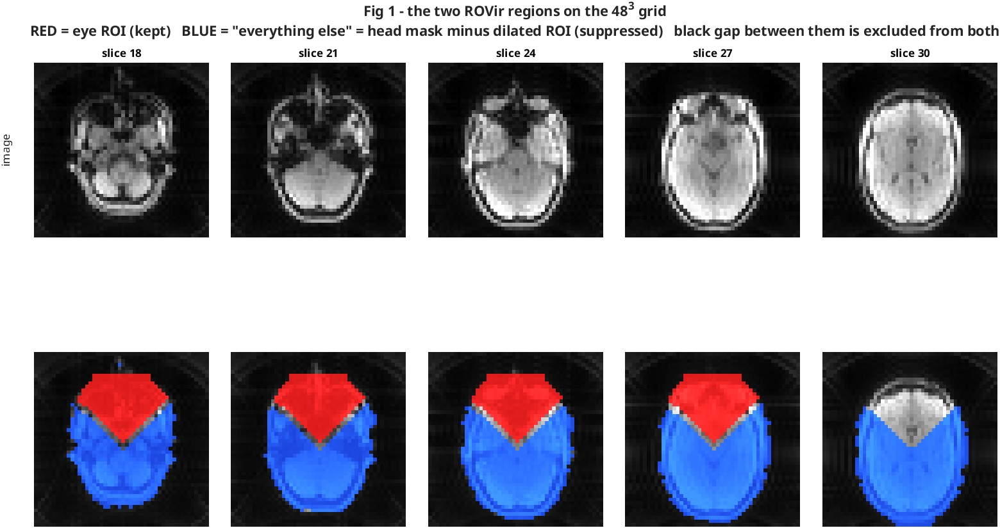
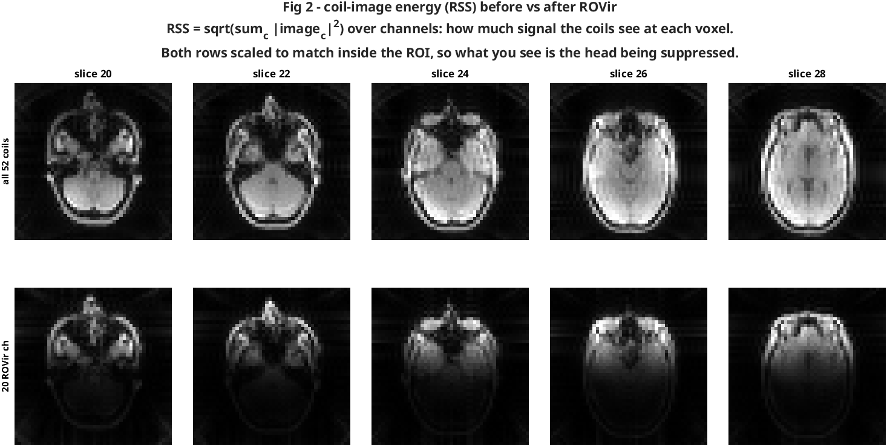
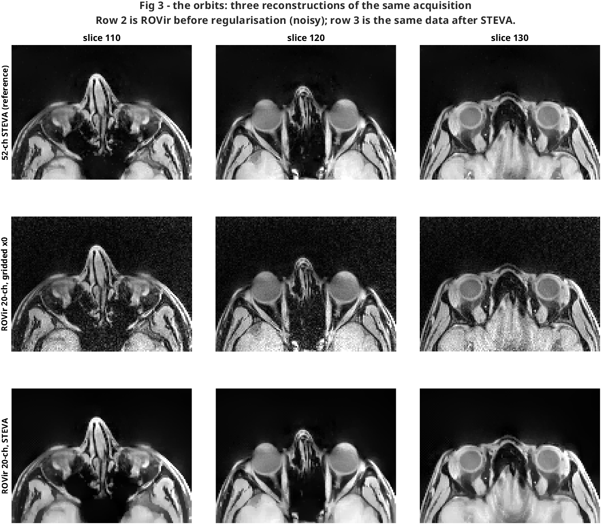
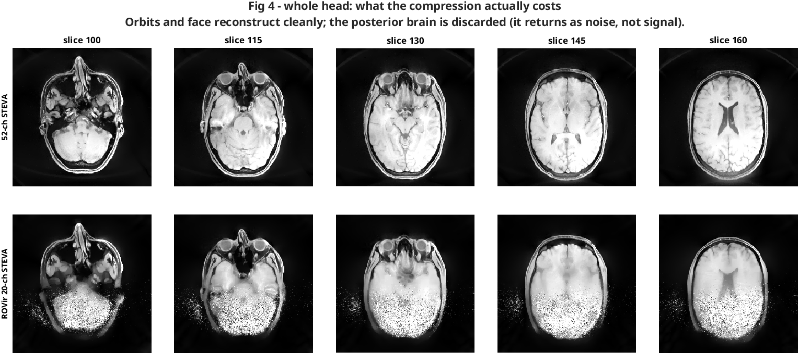
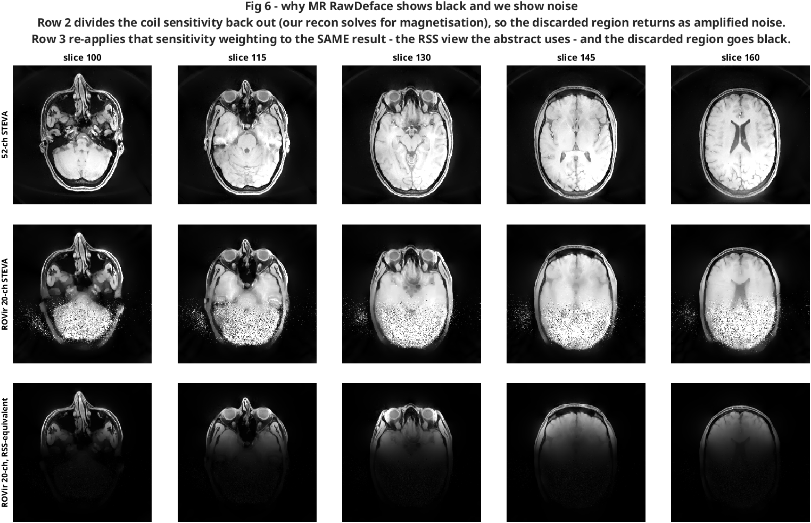
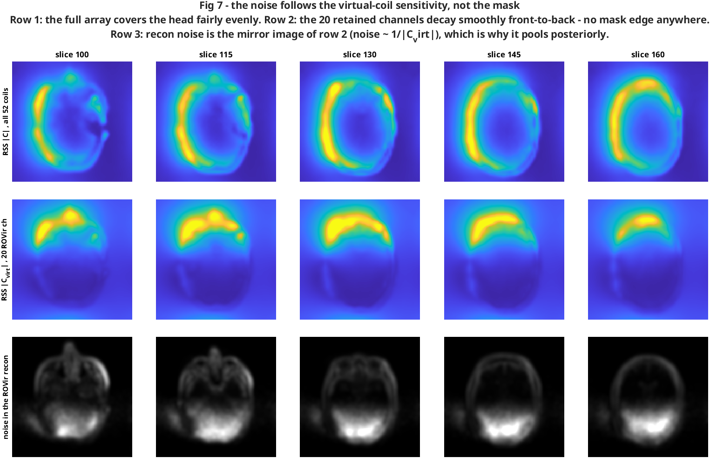
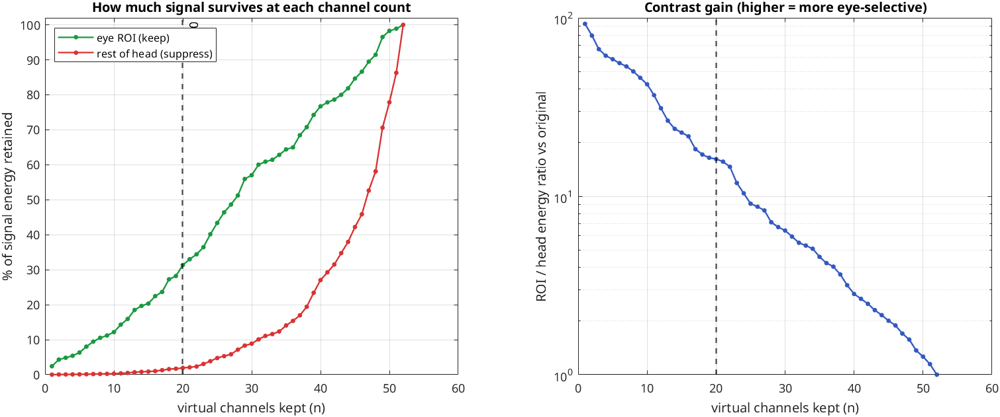
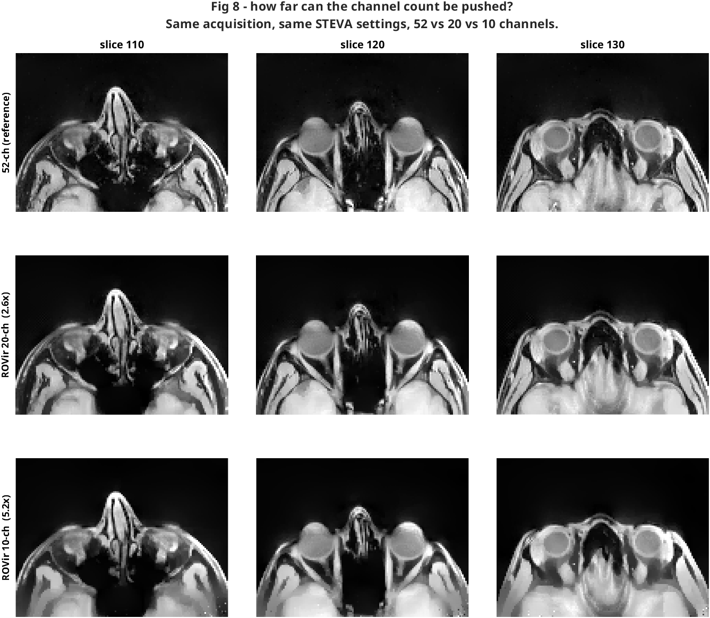

# ROVir for MR-EyeTrack

Region-optimised virtual coils, applied to keep the **orbits** and suppress the
rest of the head — the inverse of the MR RawDeface use case
([chiew-group/MRI-defacer](https://github.com/chiew-group/MRI-defacer), ISMRM
abstract), which keeps the brain and suppresses the face.

Goal: shrink the raw k-space (fewer channels) while preserving the eye region
for reconstruction.

## Method

ROVir solves the generalised eigenvalue problem

```text
A v = lambda B v      A = sum_{v in ROI} x_v x_v^H     (orbits, keep)
                      B = sum_{v in INT} x_v x_v^H     (rest of head, suppress)
```

where `x_v` is the vector of per-coil image values at voxel `v`. Eigenvectors
sorted by descending eigenvalue give a ranked basis; the leading ones
concentrate signal in the ROI. The transform acts only on the channel index, so
it commutes with the non-Cartesian encoding operator and can be applied
directly to radial k-space without regridding.

## Pipeline

| Step | Script | In | Out |
|---|---|---|---|
| R1 | `R1_rovir_masks.m` | `woBin/xrms48.mat`, manual `eyeMask.mat` | `ROVir/masks.mat` |
| R2 | `R2_rovir_transform.m` | `woBin/x0_noC_48.mat`, masks | `ROVir/rovir_transform.mat` |
| R3 | `R3_rovir_mitosius.m` | raw `.dat`, `C.mat`, transform | `mitosius/ROVir_<nv>/`, `C_rovir_<nv>.mat` |
| R4 | `R4_rovir_recon.m` | mitosius, `C_rovir_<nv>.mat` | `ROVir/x_steva_ROVir_<nv>_*.mat` |
| R5 | `R5_export_compressed.m` | mitosius | `ROVir/kspace_rovir_<nv>_<bin>.mat` + compression report |
| R6 | `R6_rovir_nifti.m` | recon `.mat` | `ROVir/*.nii.gz` |
| R7 | `R7_nv_table.m` | transform | `nv_energy_table.csv`, curves, derived smaller-nv sets |
| R8 | `R8_figures.m` | everything | `recon/ROVir/figures/` |

`rovir_solve.m` holds the maths; the R scripts are the I/O around it.

### Two variants, one codebase

Every R script takes a `variant` string and writes to `recon/<variant>/`, so
results are fully separated while the code is not:

| variant | ranking | lambda | what it is for |
|---|---|---|---|
| `ROVir` (default) | signal-to-interference | 1e-4 | suppress the head (defacing-style) |
| `ROI-PCA` | ROI signal energy | 1e6 | maximum compression, no suppression |

They are the *same* generalised eigenproblem — as `lambda` grows, `B` tends to
a scaled identity and the problem degenerates to `eig(A)`. Forking R1–R8 into a
parallel tree would be ~1500 duplicated lines that drift apart the first time
either side is fixed, so only the outputs are forked:

```text
data/study/sub-NNN/recon/ROVir/            data/study/sub-NNN/recon/ROI-PCA/
data/study/sub-NNN/recon/mitosius/ROVir_<nv>/   .../mitosius/ROI-PCA_<nv>/
```

`recon/ROI-PCA/run_roi_pca.m` is a thin entry point that just sets the
parameters and calls the shared scripts.

```matlab
subject_num = 15;
run('recon/ROVir/R1_rovir_masks.m')
run('recon/ROVir/R2_rovir_transform.m')
run('recon/ROVir/R3_rovir_mitosius.m')     % doBins = true to also split the 4 gaze bins
nv = 20; binName = 'woBin';
run('recon/ROVir/R4_rovir_recon.m')
```

## Running R4 on the HPC

R1–R3 are workstation jobs (R3 needs the 16 GB raw `.dat`). R4 is the long one
and runs happily on chacha:

```bash
bash recon/ROVir/hpc/push_rovir.sh -s 15 -n 20 -b woBin --submit
ssh chacha squeue -u '$USER'
bash recon/ROVir/hpc/push_rovir.sh -s 15 -n 20 -b woBin --pull
```

**The filer is one share seen from both machines**, so the mitosius is staged
once and stays there — repeat submissions transfer nothing:

| | path |
|---|---|
| workstation | `/mnt/filer01/MatTechLab/jaime.barranco/MR-EyeTrack/data/study` |
| chacha | `~/mnt/jaime.barranco/MR-EyeTrack/data/study` |
| inside apptainer | `/usr/src/app/data/study` |

Both are CIFS mounts of `//filer01.hevs.ch/fs_projets/MatTechLab`. Only the
scripts travel over ssh, because chacha keeps those on its own disk under
`shared_datasets/` rather than on the filer. Note the repo's own
`data/study` is a *separate local copy*, not a link to the filer — that is why
staging exists at all.

`push_rovir.sh` also stages `x0` when it exists, letting the cluster skip the
Mathilda step. `S4_rovir_recon_chacha.m` takes `FoV` as a parameter (240 for
this protocol) rather than reading it from the raw file, so the 16 GB `.dat`
never has to reach the cluster.

A full `woBin` STEVA run at nv=20 took **1 h 33 min**, 131 GB peak RSS.

## Design notes

**Everything runs on the 48³ grid.** Coil sensitivity varies on centimetre
scales, so a 5 mm grid resolves the covariance structure fine, and the manually
drawn `eyeMask.mat` is already native to it — no resampling. `x0_noC_48.mat`
also already exists for every subject, so R1/R2 cost no compute.

**48³ estimates the transform; 240³ is where it gets applied — and there is no
conflict, because the transform has no spatial dimension.** `V` is a
`[nCh x nv]` matrix acting on the *channel index only*. Estimating it means
building two `nCh x nCh` covariances, `A` and `B`, which are spatial integrals
over the ROI and the interference region; the 48³ per-coil images are just the
quadrature for those integrals. The grid resolution therefore affects only how
well the covariance is *estimated*, never the resolution of anything
downstream. Concretely:

| stage | grid | what happens |
|---|---|---|
| estimate `V` (R2) | 48³ | `A`, `B` from per-coil images; out comes a 52×20 matrix |
| apply to k-space (R3) | *none* | `y_virt = V.' * y` — raw radial data, no image grid at all |
| apply to coil maps (R3) | 48³ | `C_virt = C * V`, exactly where `C.mat` already lives |
| reconstruct (R4) | 240³ | `C_virt` resized 48³→240³ by `bmImResize`, as the main pipeline always does |

So nothing is reconstructed at 48³ and then upsampled. 5 mm is ample for the
estimate because coil sensitivity varies on centimetre scales — and it is why
the hand-drawn `eyeMask.mat`, already 48×48, needs no resampling.

**The ROI is deliberately loose, and ROI size is not a useful lever.**
Re-measured with the correct convention (the first version of this test used the
buggy `conj` and its numbers should not be trusted), ROI energy retained at
n=20:

| ROI | voxels | ROI % at n=20 |
|---|---:|---:|
| current wedge | 3432 | 31.3 |
| small box | 950 | 27.5 |
| tiny box | 476 | 28.9 |
| one globe only | 120 | 29.0 |

A 29× reduction in ROI volume moves it by ~2 points. Precision of the eye mask
is simply not where the leverage is — so a proper segmentation (A-eye or
otherwise) would not buy compression. See *the ranking criterion is the real
lever* below for why.

**The ROI is not intersected with the head mask.** The globe and orbital fat
are both dark in fat-suppressed LIBRE, so a signal threshold carves the orbit
straight out — exactly the voxels to keep.

**A gap is mandatory.** `gapVox` voxels around the ROI are excluded from both
regions. Without it the eigenproblem is asked to suppress voxels one voxel from
the ROI, which no linear coil combination can do, and the solution degenerates.

**Report the energy metric, not the Frobenius one.** MR RawDeface reports
`||P A P||_F / ||A||_F`, which squares the eigenvalue contributions a second
time and is dominated by the leading eigenvector. The physically meaningful
figure is `trace(P A)/trace(A)`, the fraction of signal *energy* retained. Both
are computed; the scripts select on the energy one.

**Convention trap.** `A = X^H X` pairs with forming virtual coils by *plain
transpose*:

```text
y_virt = Vret.' * y          C_virt = C * Vret          x_virt = X * Vret
```

Using `V'` / `conj(V)` instead still produces a perfectly believable image, but
the retained subspace no longer matches the one the eigenproblem optimised and
the suppression silently vanishes (measured: 22% interference energy instead of
0.3%). R2 asserts the identity
`sum_{v in ROI} ||Vret.' x_v||^2 == trace(Vret^H A Vret)`; do not remove it.

**Orthonormalise the retained basis.** Generalised eigenvectors are
B-orthogonal, not orthonormal, so feeding them to the recon directly would
correlate noise across virtual channels. `orth()` preserves the span.

**Normalisation and `delta`.** STEVA's `delta` is scale-dependent, so a recon
normalised differently is not comparable at the same `delta`. R3 sets
`normalize_val` from the mean magnitude over the eye ROI, non-interactively
(the S3 scripts use a hand-drawn `roipoly`). Any reference recon compared
against these must be normalised the same way.


## The compressed k-space (what to feed a model)

`R5_export_compressed.m` writes a single self-contained file:

```text
data/study/sub-015/recon/ROVir/kspace_rovir_20_woBin.mat
  y    [38 349 120 x 20]  complex single   compressed k-space
  t    [3 x 480 x 79894]  single           trajectory (kx, ky, kz)
  ve   [1 x 38 349 120]   single           volume elements (density weights)
  meta                                     nv, nCh, retention, provenance
```

**It has a fixed, smaller channel count — the signal is not collapsed into one
channel.** ROVir is a linear recombination of the channel axis: 52 physical
coils in, `nv` virtual channels out. Every virtual channel is a full radial
dataset in its own right. Nothing is done to the readout, the trajectory, or
the number of spokes, so the sampling pattern is byte-for-byte the same as the
original.

sub-015, nv=20:

| | |
|---|---|
| physical coils | 52 |
| virtual channels | 20 |
| **channel compression** | **2.60×** (38.5% of channels kept) |
| readout points per channel | 38 349 120 (unchanged) |
| k-space payload, 52 ch | 14.86 GiB |
| k-space payload, 20 ch | **5.71 GiB** |
| saved | 9.14 GiB (**61.5%**) |
| raw Siemens `.dat` on disk | 15.47 GiB (52 coils + headers) |
| exported `y`+`t`+`ve` | 6.29 GiB |

The compression ratio is exactly `nCh/nv`, so it is whatever you choose: 5.2×
at nv=10, 8.7× at nv=6. `t` and `ve` are shared across channels, so at small
`nv` they start to dominate the file — at nv=6 the payload is 1.7 GiB but the
trajectory is still ~0.6 GiB.

Note `y` is normalised (divided by mean |x0| over the eye ROI, see R3);
`meta.normalised` records this.

## What the result looks like

### The two regions



**Red is the eye ROI (kept). Blue is "everything else" (suppressed).** Blue is
*not* a brain mask — it is the whole-head mask minus the dilated ROI, so it
covers scalp, skull, brain, sinuses, temporal muscle, everything with signal.
It only *looks* brain-dominated on an axial slice because the brain is what
fills most of the head at these levels. There is no brain segmentation anywhere
in this pipeline. The thin dark band between red and blue is the deliberate gap
(`gapVox`), excluded from both.

### The coil images, before and after



**RSS = root-sum-of-squares across channels**, `sqrt(sum_c |image_c|^2)`: a
single volume summarising how much signal the channel set sees at each voxel.
It is not the reconstruction — it is a picture of the *raw coil sensitivity to
each location*, and it is where ROVir's suppression is directly visible.
Both rows are scaled to match inside the ROI, so what you are looking at is the
head being suppressed relative to the orbits, not an overall brightness change.

### The reconstructions



**Three reconstructions of the same acquisition**, cropped to the orbits.
Row 1 is the full 52-channel STEVA reference. Row 2 is ROVir at 20 channels
*before* regularisation (gridded `x0` — visibly noisy, ROI SNR 2.0). Row 3 is
that same 20-channel data *after* STEVA, which recovers most of it (ROI SNR
5.9). The globes and lenses are resolved in all three.



Zoomed out, the trade is obvious: orbits and face reconstruct cleanly at 20
channels, the posterior brain is gone. That is the intended behaviour, not a
failure — see *What the reconstruction actually does with it* below.

### Why MR RawDeface shows a black face and we show noise



Same data, two reconstruction operators. **This is entirely about whether you
invert a coil sensitivity model, not about how well ROVir worked.**

MR RawDeface combines by root-sum-of-squares and never builds sensitivity maps
— `visualization.py`:

```python
image_rsos = np.sqrt(np.sum(np.abs(image)**2, axis=3))
```

In RSS the voxel value carries the coil sensitivity as a *multiplicative*
factor, so where the retained virtual coils see nothing the image is genuinely
~0. Black.

Our pipeline solves `y = E(C_virt) m` for the magnetisation `m`, with `C_virt`
derived through the same transform. Least squares therefore **divides the
suppression straight back out**. Where `C_virt` is near zero the inversion is
ill-posed, so the discarded region comes back as amplified noise rather than as
zeros — it is a conditioning failure, not residual signal.

Mean intensity of the rest of the head relative to the orbits:

| | ratio |
|---|---:|
| 52-channel STEVA reference | 1.651 |
| ROVir 20-ch STEVA (sensitivity-corrected) | 1.621 |
| ROVir 20-ch, RSS-equivalent | **0.266** |

The sensitivity-corrected recon sits at essentially the *reference* ratio
(1.62 vs 1.65) — the suppression is fully undone. Re-applying the sensitivity
weighting to that same volume (row 3, `|x| .* sqrt(sum_j |C_virt,j|^2)`)
reproduces the abstract's look from our own data, at 6× suppression.

Practical consequence: if you want a defaced-looking *image*, reconstruct by
RSS or skip the sensitivity correction. If you want a quantitative recon of the
orbits, keep the sensitivity model and accept the noisy posterior — or restrict
the recon FOV so the ill-conditioned region is never solved for at all, which
would also cut the cost of every iteration.

### Why the noise is a smooth front-to-back gradient, not the shape of the mask



The noise does not follow the interference mask at all. Measured inside the
head:

| | correlation with recon noise |
|---|---:|
| `1 / \|C_virt\|` (virtual-coil sensitivity) | **0.876** |
| interference-mask indicator | 0.128 |

Binned by virtual-coil sensitivity, the first seven deciles are ~100% inside
the interference mask, yet noise varies **16×** across them — identical mask
membership, wildly different noise. (Deciles 8–10 tick up again only because
they are the ROI, where a high-frequency proxy picks up real anatomical edges
rather than noise.)

**The reason is that the mask's shape never reaches the optimiser.** `B` is a
`52 x 52` covariance matrix — a second-moment summary integrated over the
interference region. Every spatial detail of that region is integrated away;
all that survives is how the coils *correlate* over it. So the solution has no
mechanism to reproduce the mask outline, and cannot have a sharp edge in the
first place: coil sensitivities vary on ~10 cm scales, so any linear
recombination of them is smooth on that scale too.

What ROVir can actually do is produce combinations whose sensitivity decays
smoothly with distance from the ROI. Row 2 of the figure shows exactly that —
an anterior blob fading front-to-back, with no mask edge anywhere — against
row 1, where the full 52-coil array covers the head fairly evenly. Since recon
noise goes as `1/|C_virt|`, it is the mirror image (row 3) and pools where the
retained channels see least: the posterior brain, the point furthest from the
orbits.

The apparently sharp boundary is a display artefact: `1/|C|` diverges
nonlinearly, so a smooth decay in sensitivity crosses the display window over a
short distance and reads as an edge.

Practical consequence: the extent of the usable region is set by **coil
geometry and the position of the ROI**, not by how you draw the mask. Redrawing
the interference region will not move that boundary — which is the same reason
tightening the ROI from 3432 to 950 voxels changed the achievable suppression
by <10%.

### How many channels do you need?



Full per-channel-count numbers are in `nv_energy_table.csv` (52 rows, written
by `R7_nv_table.m`):

| n | ROI energy % | head energy % | contrast gain | compression |
|---:|---:|---:|---:|---:|
| 4  | 5.4  | 0.09 | 61.3× | 13.0× |
| 6  | 8.0  | 0.14 | 55.8× | 8.7×  |
| 8  | 10.5 | 0.21 | 50.1× | 6.5×  |
| 10 | 12.2 | 0.29 | 42.4× | 5.2×  |
| 15 | 20.3 | 0.89 | 22.7× | 3.5×  |
| **20** | **31.3** | **1.94** | **16.2×** | **2.6×** |
| 25 | 43.4 | 4.77 | 9.1×  | 2.1×  |
| 30 | 57.0 | 8.88 | 6.4×  | 1.7×  |
| 40 | 76.7 | 27.1 | 2.8×  | 1.3×  |
| 52 | 100  | 100  | 1.0×  | 1.0×  |

#### Measured: 52 vs 20 vs 10 channels



Same acquisition, same STEVA settings, reconstructed at three channel counts
(nv=10 derived from nv=20 by the nesting trick below, then run on chacha —
1 h 16 min):

| recon | ROI NRMSE | ROI corr | bg sigma | ROI SNR | compression |
|---|---:|---:|---:|---:|---:|
| 52-ch STEVA reference | 0 | 1 | 6.57e-02 | 11.3 | 1.0× |
| **ROVir 20-ch** | 0.206 | 0.970 | 1.26e-01 | **5.9** | **2.6×** |
| ROVir 10-ch | 0.296 | 0.941 | 6.27e-01 | 1.2 | 5.2× |

**nv=20 is the usable operating point; nv=10 is past the knee.** Between them
the background noise jumps 5×, and ROI SNR collapses from 5.9 to 1.2 — noise
comparable to signal. STEVA compensates the only way a TV prior can, by
smoothing, which is visible in row 3 as loss of fine orbital detail (the
extraocular muscles and orbital septum go mushy) even though the globes and
lenses survive.

Note how forgiving the correlation is: it only falls 0.970 → 0.941, because the
globe is a large smooth structure that dominates it. Correlation is the wrong
metric to choose `nv` with — SNR and visible sharpness tell the real story.
This is worth remembering if you pick an operating point from a summary number.

#### The ranking criterion is the real lever (open direction)

ROVir ranks eigenvectors by **signal-to-interference ratio**, so it deliberately
throws away eye signal to buy head suppression. That is the right objective for
defacing and the wrong one for pure compression.

The eye signal actually lives in a nearly one-dimensional coil subspace —
effective rank of `A` is **1.1–1.6** for every ROI tested. Ranking the same
covariance by ROI *energy* instead (plain eigenvectors of `A`, i.e. a
region-restricted PCA) gives a completely different trade:

| n | ROVir: ROI % / head % | ROI-PCA: ROI % / head % |
|---:|---:|---:|
| 2  | 4.3 / 0.05 | **89.1** / 26.4 |
| 4  | 5.4 / 0.09 | **96.6** / 45.0 |
| 6  | 8.0 / 0.14 | **98.6** / 57.7 |
| 20 | 31.3 / 1.94 | 99.95 / 91.3 |

**4 channels capture 96.6% of the eye signal — a 13× compression, with 3× more
eye signal retained than ROVir manages at 20 channels.** The cost is that the
head is no longer suppressed (45% retained), which matters for defacing and not
at all for feeding a model.

Not yet validated by a reconstruction — energy retention is strong evidence but
the recon is the test, and coil diversity matters more in the undersampled
binned case than in `woBin`.

**SVD vs PCA is not the meaningful axis.** For this problem they are the same
computation: `A = X^H X`, so the eigenvectors of `A` *are* the right singular
vectors of `X_roi` (verified: subspace difference 1e-5). Mean-centring — the
textbook difference — changes essentially nothing here either (96.6/43.5
centred vs 96.6/44.9 uncentred at n=4); the complex phase makes the
across-voxel mean small. Prefer `svd(Xr,'econ')` to `eig(Xr'*Xr)` on numerical
grounds only, since it avoids squaring the condition number.

What actually matters is **what you take it over**, ROI % / head % retained:

| n | ROI-restricted | global (head voxels) | global (all voxels ~ k-space) |
|---:|---|---|---|
| 4 | **96.6** / 44.9 | 68.6 / 73.0 | 68.5 / 73.0 |
| 8 | 99.4 / 66.4 | 84.2 / 87.2 | 84.5 / 87.2 |

The two global columns agree to a decimal, which is Parseval: a region-agnostic
SVD gives the same basis in image space or k-space, so it needs no image
reconstruction at all — that is the cheap standard method, and the repo already
has it (`coilCompression == 0`). ROI-restriction is what costs an image-domain
step, and it buys 28 points of eye signal at n=4.

**The existing `lambda` already interpolates between the two.** `rovir_solve`
regularises as `B + lambda*mean(diag(B))*I`; as `lambda` grows, `B` tends to a
scaled identity and the generalised problem degenerates to `eig(A)` — pure
ROI-PCA. No new code is needed to explore this:

| lambda | n=4: ROI % / head % |
|---|---|
| 1e-4 (as used) | 5.4 / 0.1 |
| 1 | 60.0 / 6.2 |
| **10** | **93.1 / 30.7** |
| 1e4+ | 96.6 / 44.9 (= ROI-PCA) |

`lambda = 10` looks like the interesting operating point: 93% of the eye signal
at 4 channels (13x compression) while still suppressing the head to 31%.

**This table cannot on its own tell you how many channels you need.** It says
how much signal energy survives, and energy is not image quality — the coils
heavily oversample the spatial information, so a large energy loss can cost
little. The only way to settle it is to reconstruct at several `n` and look at
the orbits. There is no universal answer even then: it depends on what you
measure downstream (segmentation of the globe needs less SNR than an edge-based
metric like dCTE).

Two things make that sweep cheap. The retained subspaces are **nested**
(`span(V(:,1:n'))` ⊂ `span(V(:,1:n))` for n' < n), so any smaller `nv` can be
derived from a larger one with a single matrix multiply — no re-reading the
16 GB raw file:

```matlab
subject_num = 15; srcNv = 20; deriveTo = [6 10 15];
run('recon/ROVir/R7_nv_table.m')      % writes mitosius/ROVir_<n>/ + C_rovir_<n>.mat
```

Then one `sbatch` per `n`. Deriving *upward* (nv > srcNv) needs R3 and the raw
data again. R7 asserts the nesting residual and the recombined energy, so a
convention slip cannot pass silently.

## Results, sub-015

52 physical coils. Orientation of this dataset: dim1 = A→P, dim2 = L↔R,
dim3 = I→S.

Best single physical coil SIR 0.81; best virtual coil SIR 5.72 → **7.0× over
the best physical coil**.

Energy retained by the leading *n* virtual coils:

| n | ROI % | rest-of-head % | contrast gain |
|---:|---:|---:|---:|
| 6  | 8.0  | 0.14 | 55.8× |
| 10 | 12.2 | 0.29 | 42.4× |
| 20 | 31.3 | 1.94 | 16.2× |
| 30 | 57.0 | 8.88 | 6.4×  |
| 52 | 100  | 100  | 1.0×  |

At fixed channel count, against the alternatives (ROI % / rest-of-head %):

| n=10 | ROI % | head % |
|---|---:|---:|
| ROVir | 12.2 | 0.29 |
| top-N coils by ROI energy (existing approach) | 83.4 | 32.7 |
| global SVD/PCA | 89.5 | 90.6 |
| random projection | 22.3 | 19.5 |

Global SVD has essentially no selectivity (it is region-agnostic by
construction); coil selection has some; ROVir is ~16× more selective than coil
selection at the same channel count.

The trade is real: ROVir keeps far *less* absolute ROI energy at a given `n`.
Whether that costs image quality is a question only the reconstruction answers
— total energy is not the same as reconstructability, since 52 coils heavily
oversample the spatial information.

Default operating point is `int_budget` at 2%, giving n=20 (2.6× smaller
k-space). QC figures land in `<subject>/recon/ROVir/qc/`.

### What the reconstruction actually does with it

A sensitivity-weighted reconstruction does **not** show the suppression, and
this is expected rather than a failure. ROVir suppresses the rest of the head
in the *coil images* — which is what MR RawDeface needs, because it defaces by
root-sum-of-squares and never inverts a sensitivity model. Our recon instead
solves for the magnetisation `m` from `y_virt = E(C_virt) m`, and since
`C_virt` is derived through the same transform, least squares divides the
suppression straight back out.

What survives is the conditioning. Where `C_virt` is near zero the inversion is
ill-posed, so the discarded regions come back as noise rather than as signal.
On the 240³ gridded recon at n=20 (`R3_x0_ref_vs_rovir.png`): the orbits
reconstruct cleanly, the posterior brain explodes into noise.

Measured against the 52-coil reference, intensity-matched on the ROI:

| region | NRMSE | correlation |
|---|---:|---:|
| eye ROI | 0.211 | **0.963** |
| rest of head | 0.954 | 0.541 |

Background noise sigma is 3.28× the reference, so ROI pseudo-SNR drops from 6.6
to 2.0. That SNR cost is inherent — an SNR-optimal combination uses every coil,
and n=20 retains only 31% of ROI energy. The eye *structure* is preserved
(corr 0.96); the noise is the price of the 2.6× data reduction, and is what the
STEVA TV prior in R4 has to recover.

Do not judge the result with a mean-intensity contrast ratio: noise carries
high mean magnitude, so that metric reads 0.73× (apparently worse than
reference) on a result that is in fact behaving correctly.

If the SNR cost proves too high, back off `n` — n=30 keeps 57% of ROI energy at
8.9% interference, still a 1.7× reduction.

### After STEVA (the answer)

STEVA recovers most of the noise penalty. Measured in the eye ROI against the
52-channel STEVA reference, intensity-matched:

| | ROI NRMSE | ROI corr | background sigma | ROI SNR |
|---|---:|---:|---:|---:|
| ROVir n=20, gridded `x0` | 0.231 | 0.958 | 3.68e-01 | 2.0 |
| **ROVir n=20, STEVA** | **0.206** | **0.970** | 1.26e-01 | **5.9** |
| 52-channel STEVA reference | 0 | 1 | 6.57e-02 | 11.3 |

So the TV prior lifts ROI SNR 2.0 → 5.9, about half the 52-channel reference,
at correlation 0.970 with it. Rest-of-head correlation stays at 0.644 — the
brain is still discarded, as intended (`R4_steva_wholehead.png`: clean orbits,
saturated posterior).

**Bottom line for sub-015 at n=20: 2.6× smaller k-space, eye ROI preserved at
corr 0.97, at roughly half the SNR.** Whether that trade is worth it depends on
the downstream measurement; the dCTE metric on the globe/lens edge is the test
that matters, and n=30 is the fallback if SNR turns out to be binding.
