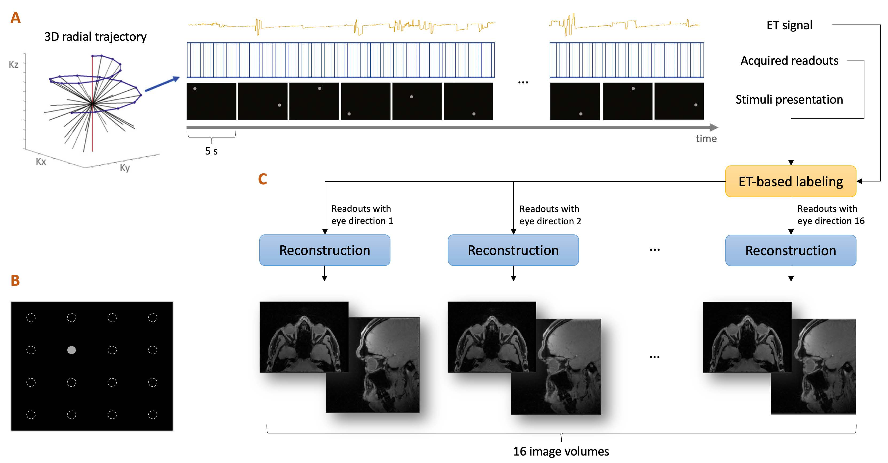

# Experiment

Schematic representation of the motion-resolved MR-Eye technique, whose acquisition protocol
will be used for this project's data collection. Panel A shows the acquisition process throughout which 16
different visual stimuli with a duration of 5s are shown to the participant at distinct and randomized moments.
The MRI data is continuously acquired using a fast-sampling strategy collecting k-space spokes (readouts) in
a 3D radial-spiral phyllotaxis trajectory. Panel B represents the screen with the possible 16 positions where
the gray circle is shown (the filled circle represents one of the visual stimuli, while the dotted circles are the 15
remaining ones). The acquired readouts are then labeled from the information given by the ET system used
throughout the acquisition and synchronized with the MRI machine. Readouts acquired during motion are
discarded, whereas the others are grouped with respect to the shown visual stimulus. By applying the
reconstruction on each of these groups of readouts, 16 different 3D motion-free T1-weighted images are
obtained, each with eyes oriented in a specific direction (panel C). Adapted from Franceschiello et al.
